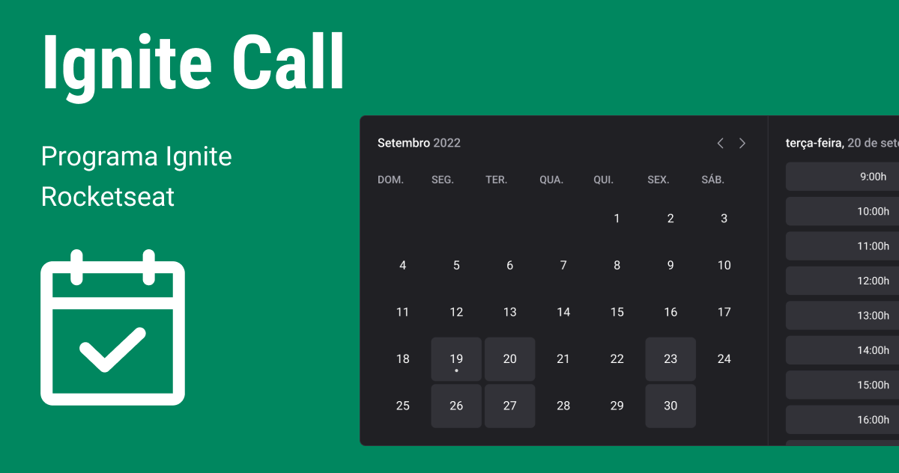

# [Ignite Call](https://ignite-call.luiscapelletto.com/)

Aplicação web de agendamentos. O usuário conecta seu google calendar, seleciona a sua disponibilidade e define o seu perfil.

Esse projeto utiliza um pacote de design system publicado no npm, pelo repositório: [Capelaum - Ignite React Design System](https://github.com/capelaum/ignite-react-design-system).

Feito no curso Ignite React, da [Rocketseat](https://www.rocketseat.com.br)

## Layout

Pode-se conferir o layout no Figma em [Figma - Ignite Call](https://www.figma.com/community/file/1161274296921389678)

## Tech

- [Next.js][next]
- [Typescript][typescript]
- [Stitches][stitches]
- [Radix UI][radix_ui]
- [zod][zod]
- [React Hook Form][react_hook_form]
- [Phosphor Icons][phosphoricons]
- [Next Auth][next_auth]
- [React Query][react_query]

[next]: https://nextjs.org
[typescript]: https://www.typescriptlang.org
[stitches]: https://stitches.dev
[phosphoricons]: https://phosphoricons.com
[radix_ui]: https://www.radix-ui.com
[zod]: https://github.com/colinhacks/zod
[react_hook_form]: https://www.radix-ui.com
[next_auth]: https://next-auth.js.org
[react_query]: https://react-query-v3.tanstack.com

## License

Pode-se conferir a [licença MIT](./LICENSE)
